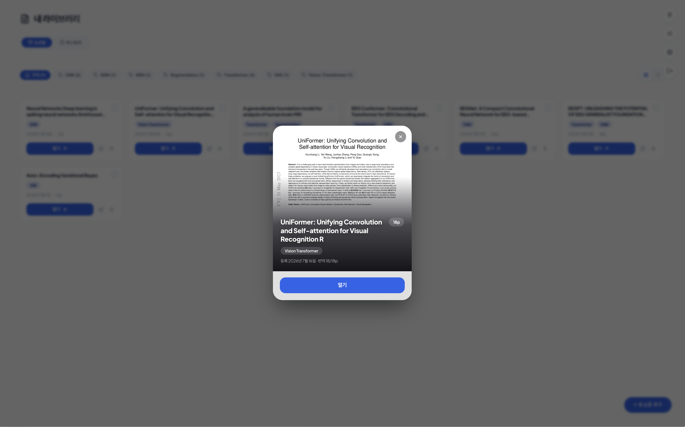
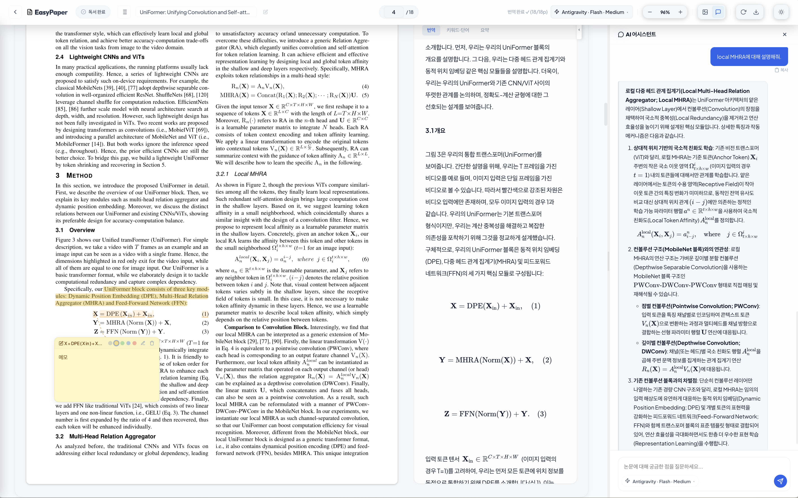
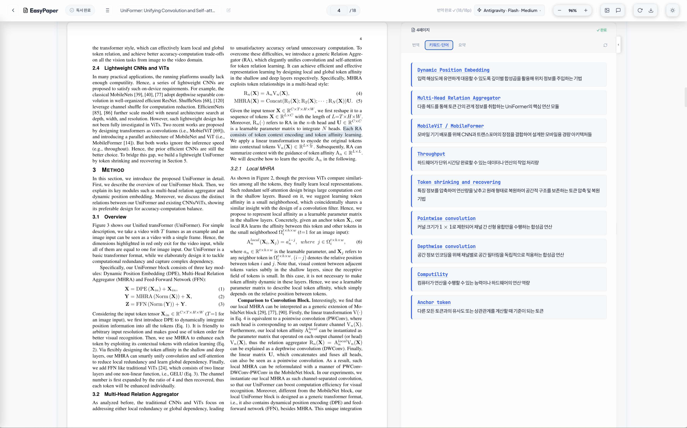

# EasyPaper

EasyPaper는 학술 PDF 논문을 AI로 번역하고 논문 내용을 기반으로 대화할 수 있는 통합 웹 서비스입니다. 
논문을 업로드하면 원문 옆에 AI 번역본이 함께 표시되며, 궁금한 내용을 바로 질문할 수 있습니다. 

본 서비스의 번역 및 어시스턴트 모델로는 로컬 Ollama 모델, 외부 API(Gemini, Claude, OpenAI), 그리고 CLI 기반 엔진(Antigravity, Claude Code, Codex)을 지원합니다.


## Screenshots
<details>
<summary>이미지 보기</summary>






</details>


---

## 빠른 시작

설치와 실행에 필요한 모든 스크립트는 `scripts/` 폴더에 모여 있습니다 — macOS·Linux용은 `scripts/sh/`, Windows용은 `scripts/bat/`에 있습니다.

**macOS / Linux**
```bash
# 1. 저장소 클론
git clone https://github.com/orion-gz/EasyPaper.git
cd EasyPaper

# 2. 설치 스크립트 실행
# (Python 가상환경 생성, 의존성 패키지 설치, .env 파일 생성, 프론트엔드 빌드 포함)
./scripts/sh/setup.sh

# 3. 서버 시작
./scripts/sh/start.sh
```

**Windows**

`scripts\bat\setup.bat` 파일을 더블클릭하거나(또는 명령 프롬프트에서 실행), 완료 후 `scripts\bat\start.bat`을 실행하면 됩니다.
```bat
git clone https://github.com/orion-gz/EasyPaper.git
cd EasyPaper
scripts\bat\setup.bat
scripts\bat\start.bat
```

서버 구동 후 브라우저에서 `http://localhost:8000` 에 접속합니다.

설치 및 생성된 모든 가상 환경과 빌드 데이터, systemd 서비스(Linux)를 완전히 지우고 원복하려면 다음 삭제 스크립트를 실행합니다:
```bash
./scripts/sh/cleanup.sh      # macOS / Linux
scripts\bat\cleanup.bat      # Windows
```

---

## 주요 기능

1. **내 라이브러리** — 라이브러리 화면에 PDF를 드래그 앤 드롭하여 바로 업로드할 수 있으며, 업로드 완료 즉시 백그라운드 번역이 시작됩니다. 카드형/리스트형 보기를 전환할 수 있고, 카테고리 필터로 원하는 논문만 모아볼 수 있습니다.
2. **AI 카테고리 자동 태깅** — 업로드 후 AI가 논문 초록과 본문을 분석하여 카테고리 태그(예: `VLM`, `VLA`, `GAN`, `CNN`,`Optimizer` 등)를 자동으로 부여합니다.
3. **정밀한 1:1 문장 매칭 & 스크롤 이동** — 원문 PDF 문장과 번역문 문장 간의 마우스 오버 하이라이트 및 클릭 시 반대편 패널 위치 자동 스크롤(양방향) 기능을 지원합니다. LLM 의미론적 태깅 정렬 방식(Semantic Tag Alignment)을 통해 정밀도 높은 문장 정렬을 제공합니다.
4. **듀얼 패널 뷰어** — 원본 PDF와 AI 번역 결과를 나란히 보며 읽을 수 있고, 패널 너비를 자유롭게 조절할 수 있습니다.
5. **AI 채팅 어시스턴트** — 논문 내용을 바탕으로 질문할 수 있으며, 답변 생성 대기 상태의 **선형 프로그레스 바(Linear Loader)**와 **현대적인 알약(Capsule) 디자인 UI**를 제공합니다.
6. **통합 모델 선택기** — UI 안에서 제공업체와 AI 모델(Ollama, Gemini, Claude, OpenAI, Antigravity, Claude Code, Codex)을 즉시 전환할 수 있습니다. 로컬에 Ollama가 설치되어 있지 않다면 설정 화면에서 원클릭으로 바로 설치할 수 있습니다.
7. **자유 배치 Floating 메모** — 논문 본문 및 번역문 위에 메모를 자유롭게 배치하여 기록할 수 있습니다. 실시간 Markdown & LaTeX 수식 렌더링, 5색 테마 컬러 피커, 커스텀 삭제 대화상자를 지원합니다.
8. **테마 색상 커스터마이징** — 설정 화면에서 프리셋 컬러 또는 컬러 피커로 서비스 전체의 강조 색상을 자유롭게 바꿀 수 있으며, 미니멀하고 절제된 다크/라이트 테마를 기본으로 제공합니다.

---

## 필수 요구사항

- **Python 3.8+**
- **Node.js 16+** & **npm**
- **Ollama** *(선택 사항 — 로컬 모델을 직접 실행하려는 경우에만 필요)*

---

## 수동 설치 방법

스크립트를 사용하지 않고 직접 환경을 구축하려는 경우:

### 백엔드
```bash
cd backend
python3 -m venv .venv
source .venv/bin/activate
pip install -r requirements.txt
cp .env.example .env
python main.py
```
- API 서버: `http://localhost:8000`
- API 문서 (Swagger): `http://localhost:8000/docs`

### 프론트엔드
```bash
cd frontend
npm install
npm run build # 프로덕션 빌드 — 백엔드가 정적 파일로 서빙
# 또는
npm run dev # 개발 서버 시작 (http://localhost:5173)
```

---

## 초기 로그인 계정

| 항목 | 값 |
|------|-----|
| 아이디 | `admin` |
| 비밀번호 | `admin` |

로그인 후 화면 우측 상단의 설정 아이콘을 눌러 언제든지 아이디와 비밀번호를 변경할 수 있습니다. 변경된 정보는 해시 처리되어 `backend/.env`에 안전하게 저장됩니다.

---

## 상시 구동 — systemd 서비스 등록 (선택 사항)

Linux 서버에서 EasyPaper를 백그라운드 데몬으로 상시 실행하려면 제공된 `easypaper.service` 파일을 활용하세요.

**1. 서비스 파일 편집** — `easypaper.service`를 열어 경로(예: `/home/ubuntu/...`)와 `User=` 값을 실제 서버 환경에 맞게 수정합니다.

**2. 서비스 등록 및 시작:**
```bash
sudo cp easypaper.service /etc/systemd/system/
sudo systemctl daemon-reload
sudo systemctl enable easypaper
sudo systemctl start easypaper
```

**3. 로그 확인:**
```bash
sudo journalctl -u easypaper -f
```

---

## CLI 기반 AI 엔진 (Antigravity / Claude Code / Codex)

EasyPaper는 Google Antigravity(`agy`), Anthropic Claude Code(`claude`), OpenAI Codex(`codex`) CLI를 서브프로세스로 연동하는 전용 LLM Provider를 내장하고 있습니다.

로컬 또는 서버 환경에 해당 CLI 프로그램이 설치되어 로그인까지 완료되어 있다면, EasyPaper가 기동 시 이를 자동으로 감지하여 라이브러리·뷰어의 모델 선택 드롭다운에 해당 공급자를 바로 활성화합니다. 별도의 추가 설정은 필요하지 않습니다.

> CLI 엔진을 사용하지 않는 경우: 설정 화면 또는 `.env`에서 Ollama, Gemini, OpenAI, Claude API 중 원하는 방식으로 자유롭게 사용할 수 있습니다.
